# 🛡️ DockDesk

<div align="center">

<a href="https://git.io/typing-svg">
  
</a>

> **The AI Auditor that ensures your Code never contradicts your Documentation.**

<p align="center">
  <a href="#-see-it-in-action">View Demo</a> •
  <a href="#-setup">Installation</a> •
  <a href="#-how-it-works">How It Works</a>
</p>

<p align="center">


</p>

</div>

---

## 🎥 See it in Action

Docs say one thing. Code does another. **DockDesk catches it before you merge.**

<div align="center">
  
</div>

---

## 💀 The Problem: "Knowledge Drift"

Developers write code faster than they write documentation.

1. ❌ Code gets updated  
2. ❌ Docs remain outdated  
3. 🔥 **Result:** API consumers suffer, onboarding slows, confusion spreads

---

## ⚡ The Solution: Active Compliance

DockDesk is not a keyword-based static analyzer.  
It's an AI auditor that understands **context and intent**.

It lives in your CI/CD pipeline and audits every Pull Request using **Gemini 2.0**.

| Feature | Description |
|--------|-------------|
| 👀 **Reads** | Scans updated code and documentation. |
| 🧠 **Thinks** | Detects contradictions like “public” vs “admin-only”. |
| 🗣️ **Speaks** | Blocks the PR & comments what must be fixed. |

---

## 🧠 How It Works

```mermaid
%%{init: {'theme': 'base', 'themeVariables': { 'primaryColor': '#2786F7', 'edgeLabelBackground':'#ffffff', 'tertiaryColor': '#f4f4f4'}}}%%
graph TD
    A([ Dev Pushes Code]) ==>|Pull Request| B( GitHub Action Triggers)
    B ==> C{📁 DockDesk Reads Files}
    C ==>|Code & Docs| D[ Gemini 2.0 AI Analysis]
    D ==>|Contradiction Detected?| E{Drift Found?}
    E == YES ==> F[❌ Block PR & Post Comment]
    E == NO ==> G[✅ Pass Checks]

    %% Styling Nodes
    style A fill:#2196F3,stroke:#fff,stroke-width:3px,color:#fff
    style B fill:#9C27B0,stroke:#fff,stroke-width:3px,color:#fff
    style C fill:#FF9800,stroke:#fff,stroke-width:3px,color:#fff
    style D fill:#00BCD4,stroke:#fff,stroke-width:3px,color:#fff
    style E fill:#FFEB3B,stroke:#333,stroke-width:3px,color:#000
    style F fill:#F44336,stroke:#fff,stroke-width:4px,color:#fff
    style G fill:#4CAF50,stroke:#fff,stroke-width:4px,color:#fff

    %% Styling Edges
    linkStyle default stroke:#90CAF9,stroke-width:4px;
```



## 📦 Setup

Create this file:

.github/workflows/dockdesk.yml


And paste:

name: DockDesk Audit
on: [pull_request]

jobs:
  audit:
    runs-on: ubuntu-latest
    permissions:
      contents: read
      pull-requests: write # Required for commenting
    steps:
      - uses: actions/checkout@v3

      - name: Run AI Auditor
        uses: srivatsa-source/dockdesk@main
        with:
          gemini_api_key: ${{ secrets.GEMINI_API_KEY }}
          github_token: ${{ secrets.GITHUB_TOKEN }}

          # Files to compare
          code_file: 'src/auth.js'
          doc_file: 'docs/API.md'

<div align="center"> Built by Vatsa </div> ```